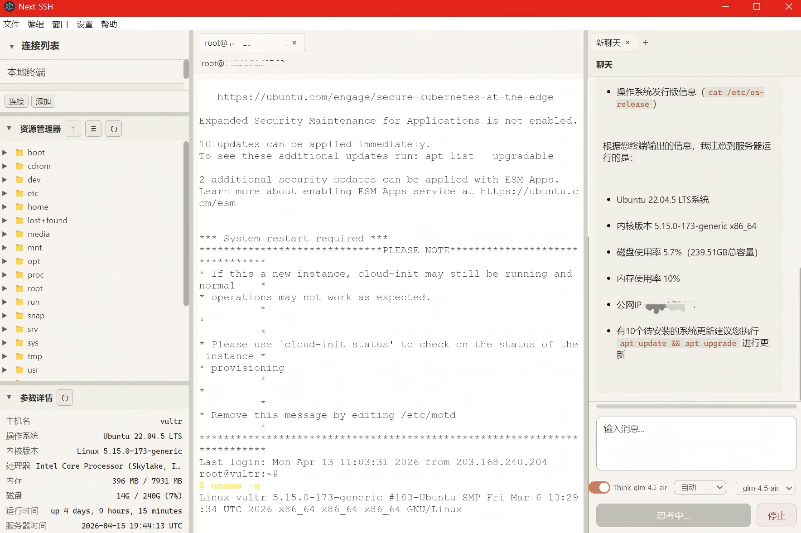

<h1 align="center">Next-SSH</h1>

<p align="center">
  <strong>AI 驱动的智能 SSH 客户端 · 服务器管理基础设施</strong><br>
  <em>用自然语言对话，让 AI 理解你的服务器、诊断问题、执行命令、验证结果。</em>
</p>

<p align="center">
  
</p>

---

## 项目定位

Next-SSH 不是一个终端模拟器。它是一个 **AI Agent 运行在 SSH 通道上的服务器智能管理平台**——AI 读取服务器状态、推理问题根因、执行修复命令、分析执行结果，形成完整的自治闭环。

我们计划基于此核心孵化两个专业版本：

| 版本 | 定位 | 目标用户 |
|------|------|----------|
| **Next-SSH Panel** | 服务器可视化自动管理面板——资产清单、状态看板、批量运维、基础设施即代码工作流 | 运维工程师、DevOps 团队 |
| **Next-SSH Security** | 网络安全加固工具——漏洞扫描、合规审计、入侵检测联动、防火墙策略编排 | 安全工程师、蓝队 |

> 两个版本均基于当前核心客户端开发，当前发布版本为共享基础。

---

## 核心功能

### AI Agent 自治闭环

用自然语言描述需求，AI 自主完成「分析 → 选命令 → 执行 → 读结果 → 决策下一步」的全流程循环，直到任务完成。

- **三级权限控制**——建议模式（只看不执行）、确认模式（逐条审批）、自动模式（全程自主）
- **多命令智能编排**——独立命令批量执行、依赖命令逐条执行、破坏性操作单条确认
- **双层安全护栏**——P0 级永久拦截（`rm -rf /`、`mkfs`、fork bomb 等）；P1 级高风险警告（`shutdown`、`iptables -F`、关键服务停止等），自动模式下跳过，确认模式下弹窗告警
- **实时上下文注入**——终端输出和当前打开的文件内容作为 AI 上下文，AI 看到你所看到的
- **17 个模型预设**——OpenAI、DeepSeek、Claude、Gemini、通义千问、智谱 GLM、Mistral、Groq、Ollama，支持任意 OpenAI 兼容 API

### 多会话 SSH 终端

- 基于 xterm.js 的多标签终端，同时连接多台服务器
- 本地终端标签与远程会话并存
- SFTP 集成的文件浏览器，拖拽上传/下载
- Monaco Editor 远程文件编辑，内置差异对比预览

### 服务器智能感知

- 服务器信息面板（主机名、操作系统、内核、CPU、内存、磁盘、运行时间）
- AI 驱动的诊断：直接问「检查防火墙」「磁盘空间分析」「MySQL 安装了吗」
- 结构化命令反馈——exit code、stdout、stderr 分离输出，错误自动分析

### 文件编辑与差异对比

- 远程文件在线编辑（Monaco Editor）
- AI 建议的文件修改自动生成差异对比预览
- 支持搜索替换格式（`---OLD--- / ---NEW---`）和模糊匹配

---

## 架构设计

```
┌─────────────────────────────────────────────────────────────────┐
│                        Electron Shell                           │
│                                                                 │
│  ┌───────────┐  ┌──────────────┐  ┌──────────────────────────┐ │
│  │  侧边栏    │  │   终端面板    │  │      AI 对话面板         │ │
│  │           │  │              │  │                          │ │
│  │ · 服务器   │  │  xterm.js    │  │   Agent Loop Engine     │ │
│  │   连接列表 │  │  多标签页     │  │   ┌──→ 流式获取 AI 响应   │ │
│  │ · 文件     │  │  多连接并行   │  │   │    提取命令           │ │
│  │   浏览器   │  │              │  │   │    安全检查           │ │
│  │ · 服务器   │  │              │  │   │    通过 SSH exec 执行 │ │
│  │   状态信息 │  │              │  │   │    结果反馈回 AI ──┘   │ │
│  └───────────┘  └──────────────┘  │                          │ │
│                                   │   上下文：终端输出 + 文件  │ │
│                                   └──────────────────────────┘ │
│                                                                 │
│  ┌──────────────────────────────────────────────────────────┐   │
│  │                   Main Process (Node.js)                  │   │
│  │                                                          │   │
│  │  ssh2 ─── SSH/SFTP 通道（交互式 PTY + exec 命令执行）     │   │
│  │  better-sqlite3 ─── 本地数据存储（会话、消息、配置）       │   │
│  │  fetch SSE ─── OpenAI 兼容流式 API（带超时保护）           │   │
│  │  contextBridge ─── 安全 IPC（结构化数据传输）              │   │
│  └──────────────────────────────────────────────────────────┘   │
└─────────────────────────────────────────────────────────────────┘
```

**核心设计决策：**

- **SSH exec 通道**与交互式 PTY 分离——Agent 循环通过 exec 通道获取干净的 stdout/stderr/exit code，不受终端转义序列干扰
- **字符级上下文滑动窗口**——始终保留首条用户消息（原始任务），从最新消息向前填充至 16K 字符预算，单条消息超过 4K 自动截断
- **流式超时三重保护**——主进程 fetch AbortController（120s）+ 流读取空闲超时（90s）+ 渲染进程 Promise 超时兜底（120s），确保不会无限挂起
- **无框架 UI**——纯 TypeScript + CSS，零运行时依赖，极致轻量

---

## 快速开始

1. 从 [Releases](https://github.com/23Star/Next-SSH/releases) 下载安装包（Windows / macOS / Linux）
2. 启动应用 → 左侧栏点击「添加」填入服务器信息（主机、端口、用户、密码或密钥）
3. 选中服务器 → 点击「连接」→ 终端自动打开
4. 右侧 AI 面板 → 设置中配置 API Key → 直接用自然语言提问

---

## 从源码构建

**环境要求：** Node.js 18+、npm 或 pnpm

```bash
git clone https://github.com/23Star/Next-SSH.git
cd Next-SSH
npm install
npm run build
npm run package:win   # 或 package:mac / package:linux
```

构建产物输出到 `release/` 目录。

### 开发模式

```bash
npm run dev    # 热重载开发服务器（主进程 + 渲染进程 + Electron）
```

| 目录 | 说明 |
|------|------|
| `main/` | Electron 主进程——SSH 连接、IPC 通信、数据库、AI API 调用 |
| `renderer/` | 渲染层——终端、对话、文件浏览器、编辑器 |
| `preload/` | Context Bridge（安全 IPC 桥接） |
| `config/` | TypeScript & 构建配置 |
| `resource/` | 国际化语言包、静态资源 |

---

## AI 配置

Next-SSH 采用 **OpenAI 兼容的 Chat Completions API** 标准——任何实现该标准的提供商均可使用。

1. 打开 **设置 → AI 配置**
2. 填入 **API URL**（如 `https://api.openai.com/v1`）
3. 填入 **API Key**
4. 选择或输入 **模型名称**（也可点击「检测模型」自动列出可用模型）
5. 可选调整 Temperature、Max Tokens、系统提示词

**思维链/推理模式**按模型自动检测（DeepSeek R1、Claude、Qwen QwQ、GLM Z1、OpenAI o 系列、Gemini Thinking），在对话工具栏切换「思考」开关即可启用。

---

## 支持的 AI 提供商

| 提供商 | 预设模型 | 思维链 |
|--------|----------|--------|
| OpenAI | GPT-4o, GPT-4.1 | o1, o3, o4 |
| DeepSeek | V3, R1 | R1 |
| Anthropic | Claude Sonnet/Opus | Claude 3.5+ |
| Google | Gemini Flash/Pro | Flash Thinking |
| 通义千问 | Turbo, Plus, Max, QwQ | QwQ, Qwen3 |
| 智谱 GLM | GLM-5, GLM-4.7, Z1 | Z1 |
| Mistral | Mistral Large | — |
| Groq | Mixed | — |
| Ollama | 本地模型 | — |
| 自定义 | 任意 OpenAI 兼容端点 | 自动检测 |

---

## 未来规划

### 近期（核心增强）

- [ ] 对话历史持久化与搜索
- [ ] MCP（Model Context Protocol）集成——可扩展工具调用
- [ ] AI 对话自动识别用户语言
- [ ] 终端会话录制与回放
- [ ] 快捷命令面板（Ctrl+K 风格命令搜索）

### 中期——Next-SSH Panel

服务器可视化自动管理面板，面向运维团队：

- [ ] Web Dashboard——服务器资产清单、实时状态看板
- [ ] 批量运维——多服务器并行命令执行、结果聚合
- [ ] 基础设施即代码——类 Ansible Playbook 的声明式配置管理
- [ ] 监控集成——Prometheus/Grafana 数据源接入、告警联动
- [ ] 多用户协作——团队共享连接、权限分级、操作审计日志

### 远期——Next-SSH Security

网络安全加固工具集，面向安全工程师：

- [ ] 漏洞扫描引擎——自动化 CVE 检测与修复建议
- [ ] 合规审计——CIS Benchmark / 等保合规自动检查
- [ ] 入侵检测联动——日志分析、异常行为识别、实时告警
- [ ] 防火墙策略编排——可视化规则管理、策略模板、批量下发
- [ ] 安全审计日志——全量操作记录、溯源分析、合规报告生成

---

## 技术栈

| 层级 | 技术 |
|------|------|
| 桌面框架 | Electron |
| UI | 纯 TypeScript + CSS（无框架依赖） |
| 终端 | xterm.js + node-pty |
| SSH | ssh2 |
| 编辑器 | Monaco Editor |
| AI | OpenAI 兼容流式 API |
| 数据库 | better-sqlite3 |
| 构建 | Vite + TypeScript |
| 国际化 | 内置 i18n（中文 / English / Русский） |

---

## License

MIT License

---

## Links

- [Releases](https://github.com/23Star/Next-SSH/releases) — 下载安装包
- [Issues](https://github.com/23Star/Next-SSH/issues) — 问题反馈与功能建议

---

<p align="center">
  Built by <strong>PANDAAS</strong><br>
  <em>基础设施很复杂，管理它不该也是。</em>
</p>
