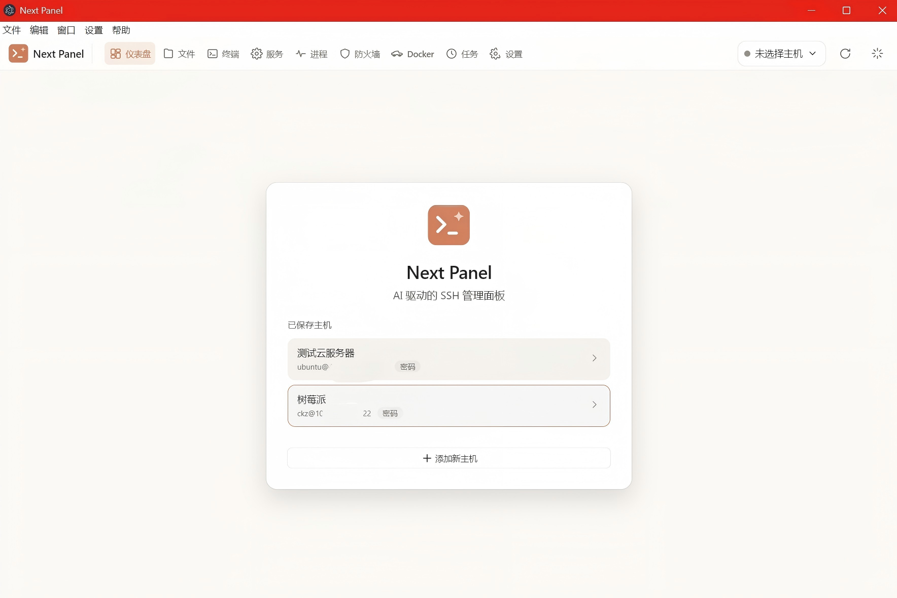

<h1 align="center">Next Panel</h1>

<p align="center">
  
</p>

<p align="center">
  <strong>AI 驱动的智能 SSH 服务器管理面板</strong><br>
  <em>用自然语言对话，让 AI 理解你的服务器、诊断问题、执行命令、验证结果。</em>
</p>

## 项目简介

Next Panel 是一个基于 Electron 的桌面应用，提供 SSH 服务器的可视化管理面板。集成了 AI 对话助手，支持自然语言运维，包含服务器状态监控、文件管理、终端、服务管理、进程监控、防火墙管理、Docker 容器管理、计划任务等功能。

---

## 功能特性

### 管理面板

- **仪表盘** — 实时展示 CPU、内存、磁盘、进程、监听端口等系统快照
- **文件管理** — 远程目录浏览、面包屑导航、Monaco 编辑器在线编辑、图片/压缩包预览、上传/下载/删除/解压
- **SSH 终端** — xterm.js 多标签终端，支持多连接并行
- **服务管理** — systemd 服务列表、启停/重启操作、状态详情与日志预览
- **进程监控** — 实时进程列表，CPU/内存排序，自动刷新
- **防火墙** — 自动检测 UFW/firewalld/iptables，开关控制，规则管理
- **Docker** — 检测安装状态，容器列表，启动/停止/重启
- **计划任务** — Crontab 编辑器，调度解析，快速参考
- **AI 助手** — 侧边栏 AI 对话，支持多模型，上下文感知服务器状态

### AI Agent

- 自然语言描述需求，AI 自主完成分析→执行→反馈闭环
- 三级权限控制（建议/确认/自动）
- 双层安全护栏（P0 永久拦截 + P1 高风险警告）
- 实时上下文注入（终端输出 + 文件内容）
- 17+ 模型预设（OpenAI、DeepSeek、Claude、Gemini 等）

### 连接后预加载

连接服务器后自动预加载所有面板数据（服务、进程、防火墙、Docker、计划任务），带进度条指示，切换页面即时展示。

---

## 技术栈

| 层级 | 技术 |
|------|------|
| 桌面框架 | Electron |
| UI | React + TypeScript + CSS（v2 面板） |
| 终端 | xterm.js + node-pty |
| SSH | ssh2 |
| 编辑器 | Monaco Editor |
| AI | OpenAI 兼容流式 API |
| 数据库 | better-sqlite3 |
| 构建 | Vite + TypeScript |

---

## 快速开始

1. 从 [Releases](https://github.com/23Star/Next-SSH/releases) 下载安装包
2. 启动应用 → 设置中添加服务器信息
3. 连接服务器 → 面板自动加载数据
4. 右侧 AI 面板配置 API Key → 自然语言提问

## 从源码构建

```bash
git clone https://github.com/23Star/Next-SSH.git
cd Next-SSH
npm install
npm run build
npm run package:win   # 或 package:mac / package:linux
```

### 开发模式

```bash
npm run dev
```

| 目录 | 说明 |
|------|------|
| `main/` | Electron 主进程 — SSH 连接、IPC、数据库、AI API |
| `renderer/` | 渲染层 — v1 旧界面 + v2 面板 |
| `renderer/v2/` | 新版管理面板（React） |
| `preload/` | Context Bridge（安全 IPC 桥接） |
| `config/` | TypeScript & 构建配置 |
| `resources/` | 图标、静态资源 |

---

## 项目结构

```
renderer/v2/
├── App.tsx              # 根组件，路由 + 全局状态
├── components/          # 通用组件（Icon、EmptyState、Card、Gauge）
├── lib/                 # 工具库（electron IPC、cache、format、preload）
├── pages/               # 页面组件
│   ├── Dashboard.tsx    # 仪表盘
│   ├── Files.tsx        # 文件管理器
│   ├── Terminal.tsx     # SSH 终端
│   ├── Services.tsx     # 服务管理
│   ├── Processes.tsx    # 进程监控
│   ├── Firewall.tsx     # 防火墙
│   ├── Docker.tsx       # Docker 容器
│   ├── Cron.tsx         # 计划任务
│   ├── Settings.tsx     # 设置
│   └── ConnectPage.tsx  # 连接页
├── shell/               # 布局组件（Topbar、AIDrawer、HostPicker）
└── styles/              # CSS（tokens.css 设计变量 + app.css 组件样式）
```

---

## 支持的 AI 提供商

| 提供商 | 预设模型 | 思维链 |
|--------|----------|--------|
| OpenAI | GPT-4o, GPT-4.1 | o1, o3, o4 |
| DeepSeek | V3, R1 | R1 |
| Anthropic | Claude Sonnet/Opus | Claude 3.5+ |
| Google | Gemini Flash/Pro | Flash Thinking |
| 通义千问 | Turbo, Plus, Max, QwQ | QwQ, Qwen3 |
| 智谱 GLM | GLM-5, GLM-4.7, Z1 | Z1 |
| Mistral | Mistral Large | — |
| Groq | Mixed | — |
| Ollama | 本地模型 | — |
| 自定义 | 任意 OpenAI 兼容端点 | 自动检测 |

---

## Star History

[](https://star-history.com/#23Star/Next-SSH&Date)

---

## License

MIT License

---

<p align="center">
  Built by <strong>PANDAAS</strong>
</p>
