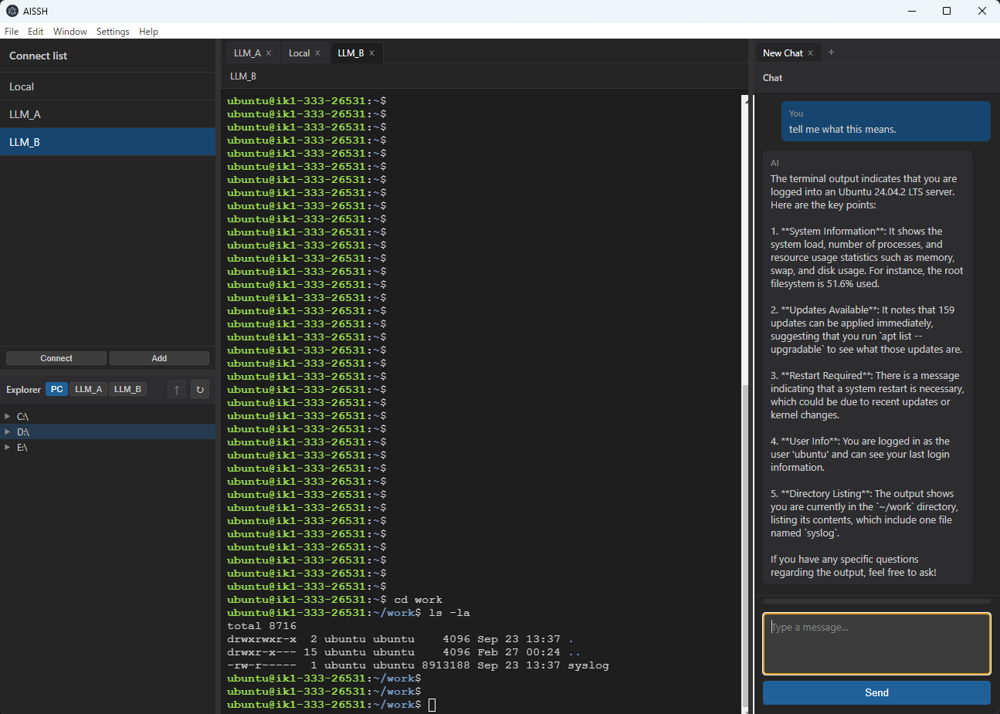

# AISSH

**AI × SSH Hybrid Management Tool** — A desktop app that lets you manage multiple servers in one place and run commands while chatting with AI.

---

## What it does (in 3 lines)

- **Manage multiple VPS in one app** … Register and select hosts in the sidebar, and use the terminal, file editor, and AI chat in the same window.
- **AI suggests commands** … Ask in plain language and GPT suggests commands. Run them on your SSH targets with one click.
- **Replace TeraTerm / PuTTY** … VSCode-style UI for SSH, remote file editing, and local terminals in one place.

---

## Features

| Feature | Description |
|---------|-------------|
| Server list | Register connection targets (Environments). Supports password and key auth. Credentials are stored encrypted locally. |
| SSH terminal | xterm.js terminal with multiple tabs and connections. |
| Remote files | Browse and edit remote files (Monaco Editor) with diff preview. |
| AI chat | After sign-in, ask in natural language → get command suggestions → approve and run. Free tier and paid plans available. |
| Local terminal | Run a local shell in a tab alongside remote sessions. |

---

## Screenshots



---

## Download & install

### Release builds (recommended)

Download the installer or binary for your OS from [Releases](../../releases).

- **Windows** … `.exe` or NSIS installer
- **macOS** … `.dmg`
- **Linux** … `.deb` etc.

### Build from source

- **Node.js** 18+
- **npm** or **pnpm**

```bash
git clone https://github.com/hasimoto820/aissh-app.git
cd aissh-app
npm install
npm run build
npm run package:win   # or package:mac / package:linux
```

Build output goes to the `release/` directory.

---

## Quick start

1. Launch the app.
2. In the left sidebar, use “Add server” to register a host (hostname, user, auth method).
3. Select a host from the list and click “Connect”.
4. Run commands in the center terminal. You can also use the right-hand chat panel to ask AI for commands and run them with one click.
5. Open and edit remote files from the explorer in the lower-left sidebar.

---

## Configuration (for chat & auth)

To use AI chat and account features, you need a Firebase project.

- The app uses **Firebase Auth** (e.g. Google sign-in).
- Chat is powered by Firebase Cloud Functions calling the OpenAI API (API key is stored in Secret Manager on the server).

**To run it yourself:**

- Create a project in the Firebase console and enable Auth and Functions.
- Put your Firebase config (e.g. `apiKey`) in `config/firebase.local.json`.  
  Do not commit this file; keep it in `.gitignore`. In README or samples, only describe how to set it up.
- Add `OPENAI_API_KEY` (and any other secrets) to Cloud Functions Secret Manager and deploy Functions.

Do not commit API keys or other secrets to the repository.

---

## Tech stack

- **Electron** + **React** (Vite)
- **xterm.js** / **node-pty** (terminal)
- **ssh2** (SSH)
- **Monaco Editor** (file editing)
- **Firebase** (auth, Functions)
- **OpenAI API** (chat, command suggestions)
- **better-sqlite3** (local DB)

---

## Development (contributing)

```bash
npm install
npm run dev    # Start in dev mode (Main + Renderer + Electron)
```

- Main process: `main/`
- Renderer (UI): `renderer/`
- Preload: `preload/`
- Cloud Functions: `functions/`

---

## License

MIT License

---

## Links

- [Releases](../../releases) — Download binaries and installers
- [Issues](../../issues) — Bug reports and feature requests
